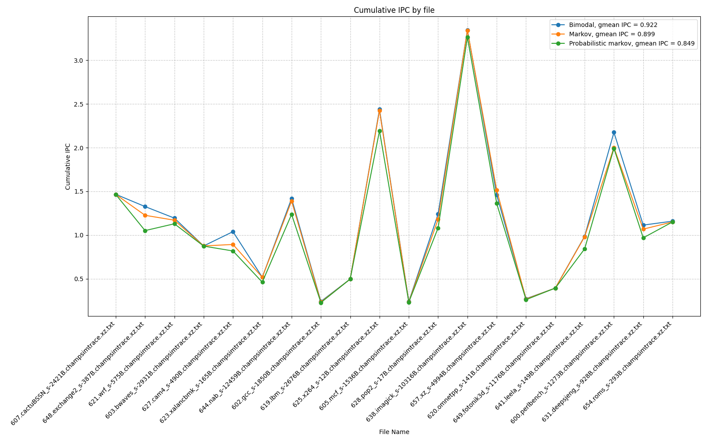
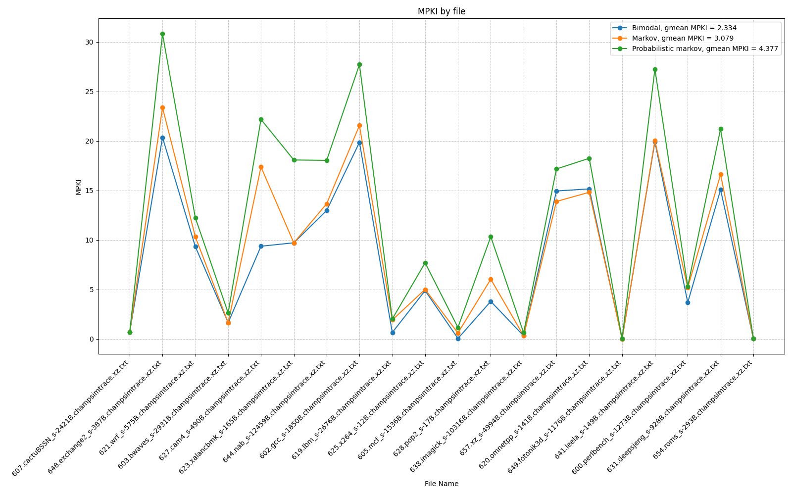

# Task 1. Branch predictors comparison
## Введение
Целью данной задачи является реализация и сравнение производительности предсказателей ветвлений (branch predictors): бимодального (bimodal), марковского (Markov) и вероятностного марковского (probabilistic Markov). Сравнение проводилось на основе двух метрик: геометрического среднего IPC (Instructions Per Cycle) и MPKI (Misses Per Kilo Instructions) на выбранных тестовых трассах.

Ожидаем, что markov будет работать хуже чем bimodal, поскольку markov использует обычные счетики, в отличие от счетчиков
сатурации, используемых в bimodal. Обычные счеткики не имеют ограничения сверху, поэтому являются инерционными.
Инерционность проявляется в том, что если счеткик равен N на переход в одну сторону, нужно будет 
дожидаться N раз промахов, чтобы вероятность перехода в другую сторону стала 50%, и только затем возможно предсказания перехода в другю сторону.

## Результаты
Перейдем к полученным результатам.
Рассмотрим график IPC, по оси x файл на котором производились замеры, по оси y -- IPC:

и график MPKI, по оси x также файл на котором производилосьь измерение, по оси y -- MPKI:

Геометрические средние значения IPC и MPKI для всех предсказателей приведены в таблице:

|            | bimodal | markov | probabilistic markov |
| ---------- | --------| ------ | -------------------- |
| gmean IPC  | 0.922   | 0.899  | 0.849                |
| gmean MPKI | 2.334   | 3.079  | 4.377                |

## Анализ
Как и ожидалось, markov имеет меньший IPC по сравнению с бимодальным бранч предиктором и больше misspredictions.
Probabolistic markov имеет результат хуже, чем у markov.
Объясниить это можно тем, что probabolistic markov добавляет вероятность перейти в противоположную сторону бранча путем введения распределения. Это помогает снизить инертность, но в тоже время ухудшает поведение в ситуации, где нужно было предсказать переход в одну сторону, а из-за вероятностного характера мы предсказываем переход в другую строну.

## Выводы
Бимодальный предсказатель превосходит марковский и вероятностный марковский по метрикам IPC и MPKI благодаря использованию счетчиков сатурации, которые быстрее адаптируются к изменениям в поведении ветвлений.

Вероятностный марковский предсказатель, несмотря на попытку уменьшить инерционность, ухудшает производительность из-за случайных переходов, что делает его менее точным.

Результаты подтверждают гипотезу о влиянии инерционности счетчиков на производительность предсказателей.
