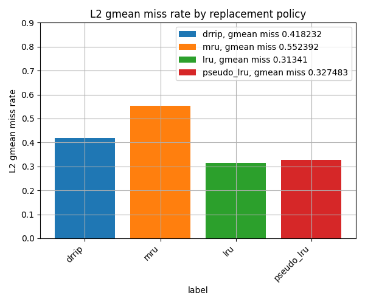

# Task 2. Replacement policies comparison
## Введение
Во второй задаче требовалось реализовать политику замещения Pseudo-LRU (PLRU) и одну дополнительную политику на выбор. Я выбрал MRU (Most Recently Used). Реализованные политики для кэша L2 были сравнены с LRU (Least Recently Used) и DRRIP по критерию miss rate, который рассчитывается как:

$$miss~ rate = \frac{all~ misses}{all~ accesses}$$

Для каждой политики и каждой трассы был вычислен miss rate, а затем среднее значение определено как геометрическое среднее (gmean). Результаты представлены на столбчатой диаграмме.

## Результаты

## Анализ

LRU демонстрирует наилучший результат с самым низким miss rate. Это ожидаемо, так как LRU точно отслеживает наименее используемые элементы, минимизируя промахи.

PLRU показывает результат, близкий к LRU, но с чуть большим miss rate. Это объясняется тем, что PLRU лишь аппроксимирует LRU и в некоторых случаях удаляет не наименее используемый элемент, а близкий к нему по порядку заполнения. Однако PLRU проще в аппаратной реализации и хранит путь к удаляемой ноде, что может улучшать производительность в других аспектах.

DRRIP оказался хуже PLRU, хотя ожидалось, что он покажет лучшие результаты. Вероятно, это связано с особенностями реализации DRRIP в симуляторе ChampSim, которые не полностью раскрывают его потенциал.

MRU показал наихудший результат, что логично, так как удаление наиболее недавно использованного элемента противоречит типичным паттернам доступа к кэшу, где недавно использованные данные с большей вероятностью будут запрошены снова.

## Вывод

LRU остается наиболее эффективной политикой по критерию miss rate. PLRU является хорошей альтернативой с упрощенной реализацией. DRRIP требует дальнейшего анализа для выявления причин его низкой эффективности в данной реализации. MRU, как и ожидалось, не подходит для большинства сценариев из-за высокого miss rate.
